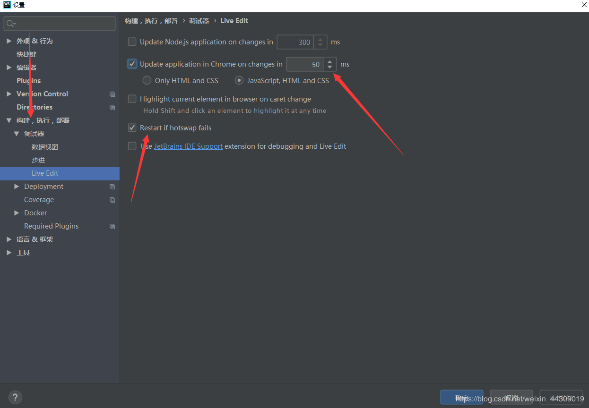
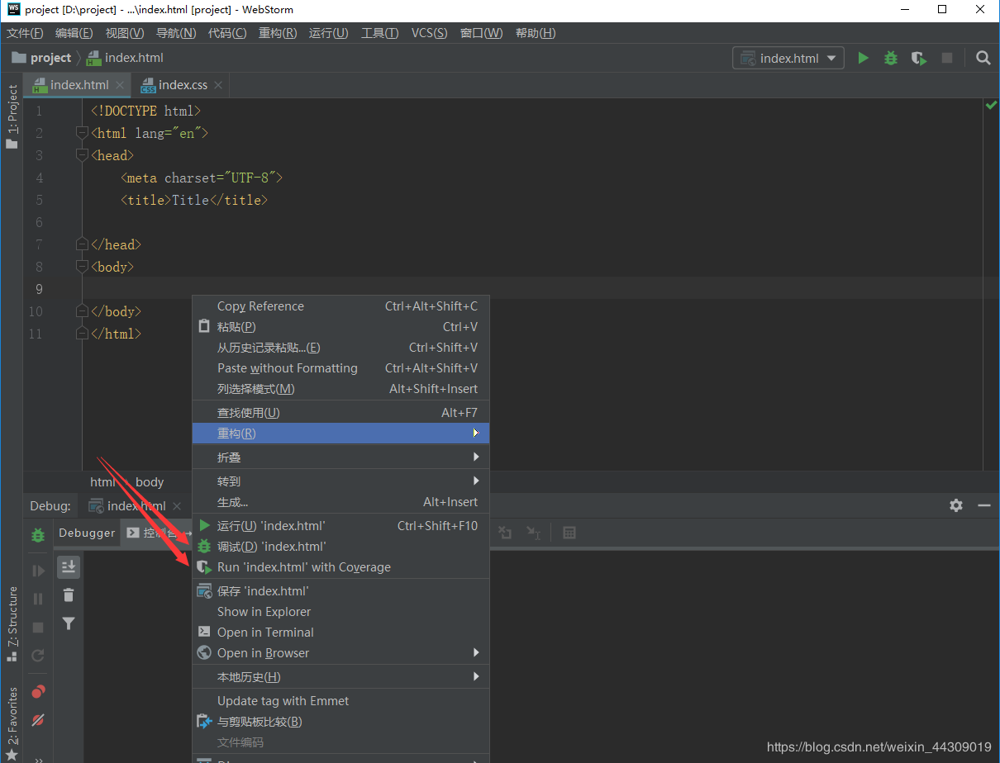

原文链接：https://blog.csdn.net/weixin_44309019/java/article/details/89339950

# WebStorm实现浏览器代码同步刷新——从此告别ctrl+s、F5

## 前言
这次介绍的是使用WebStorm代码编辑器，并给chrome装上插件。完成代码同步浏览器，实现同步刷新的效果。从此彻底告别ctrl+s、F5，告别经常重复的这两个动作。
选择WebStorm实现的效果是比较好的，在它的页面右边有多个多个浏览器logo可供选择。方便你可以在多个浏览器上查看效果（前提是这几个浏览器你都已经安装好）。

## 步骤一
首先我们要对WebStorm进行设置
- 打开WebStorm，打开文件->构建、执行、部署->调试器->LiveEdit。若没有安装汉化包的webstorm->file->setting搜 live edit 。
- 勾选Update application in Chrome on changes in 50 ms 这个50ms，根据你们的- 需求填写，若需要1秒之后刷新填写1000ms即可。
- 勾选Restart if hotswap fails

这样我们在WebStorm上就设置好了，接下来让我们来设置chrome浏览器上的。

##  步骤二
在chrome浏览器的安装JetBrains IDE Support。
- 点击浏览器右上角的三个小点->选择更多工具->扩展程序
- 在网上搜索JetBrains IDE Support，点击安装

接着返回WebStorm页面，点击右键选择以下两个就设置完成了。
