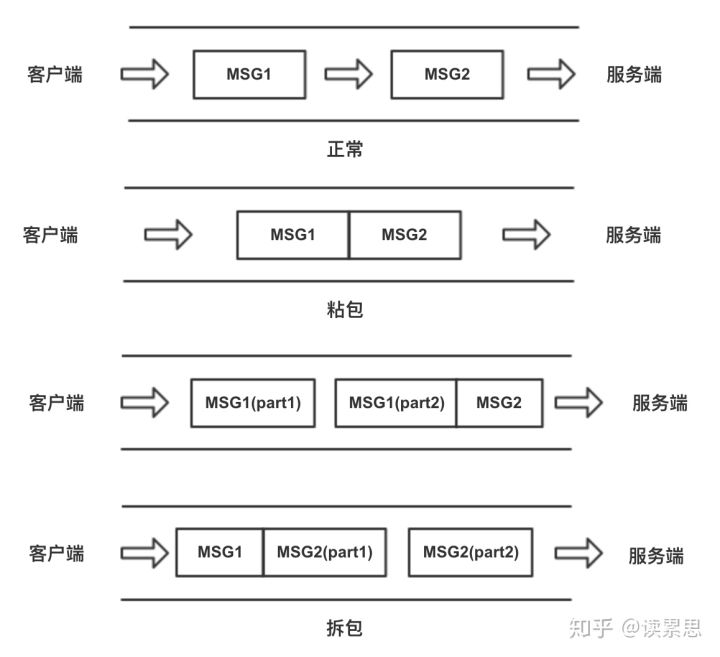

# 启示
写文章就应该像这个人写的一样，简单易懂，充满逻辑

# 问题核心
TCP是面向流的，所以在应用层会出现拆包和粘包问题。

粘包与拆包是由于TCP协议是字节流协议，没有记录边界所导致的。  
所以如何确定一个完整的业务包就由应用层来处理了。  
（这就是分包机制，本质上就是要在应用层维护消息与消息的边界。）  
分包机制一般有两个通用的解决方法：  
1. 特殊字符控制，例如FTP协议。  
2. 在包头首都添加数据包的长度，例如HTTP协议。


# 代码演示
作者：读累思  
链接：https://zhuanlan.zhihu.com/p/77275039  
来源：知乎  
著作权归作者所有。商业转载请联系作者获得授权，非商业转载请注明出处。


## 简介
拆包和粘包是在socket编程中经常出现的情况，在socket通讯过程中，如果通讯的一端一次性连续发送多条数据包，tcp协议会将多个数据包打包成一个tcp报文发送出去，这就是所谓的粘包。而如果通讯的一端发送的数据包超过一次tcp报文所能传输的最大值时，就会将一个数据包拆成多个最大tcp长度的tcp报文分开传输，这就叫做拆包。

## 一些基本概念
### MTU
泛指通讯协议中的最大传输单元。一般用来说明TCP/IP四层协议中数据链路层的最大传输单元，不同类型的网络MTU也会不同，我们普遍使用的以太网的MTU是1500，即最大只能传输1500字节的数据帧。可以通过ifconfig命令查看电脑各个网卡的MTU。

### MSS
指TCP建立连接后双方约定的可传输的最大TCP报文长度，是TCP用来限制应用层可发送的最大字节数。如果底层的MTU是1500byte，则 MSS = 1500- 20(IP Header) -20 (TCP Header) = 1460 byte。

### 示意图
如图所示，客户端和服务端之间的通道代表TCP的传输通道，两个箭头之间的方块代表一个TCP数据包，正常情况下一个TCP包传输一个应用数据。粘包时，两个或多个应用数据包被粘合在一起通过一个TCP传输。而拆包情况下，会一个应用数据包会被拆成两段分开传输，其他的一段可能会和其他应用数据包粘合。



## 代码示例
下面通过简单实现两个socket端通讯，演示粘包和拆包的流程。客户端和服务端都在本机进行通讯，服务端使用127.0.0.1监听客户端，客户端也在127.0.0.1发起连接。
### 粘包
1. 实现服务端代码，服务监听55533端口，没有指定IP地址默认就是localhost，即本机IP环回地址 127.0.0.1，接着就等待客户端连接，代码如下：
    ```JAVA
    public class SocketServer {
        public static void main(String[] args) throws Exception {
            // 监听指定的端口
            int port = 55533;
            ServerSocket server = new ServerSocket(port);

            // server将一直等待连接的到来
            System.out.println("server将一直等待连接的到来");
            Socket socket = server.accept();
            // 建立好连接后，从socket中获取输入流，并建立缓冲区进行读取
            InputStream inputStream = socket.getInputStream();
            byte[] bytes = new byte[1024 * 1024];
            int len;
            while ((len = inputStream.read(bytes)) != -1) {
                //注意指定编码格式，发送方和接收方一定要统一，建议使用UTF-8
                String content = new String(bytes, 0, len,"UTF-8");
                System.out.println("len = " + len + ", content: " + content);
            }
            inputStream.close();
            socket.close();
            server.close();
        }
    }
    ```
2. 实现客户端代码，连接服务端，两端连接建立后，客户端就连续发送100个同样的字符串；
    ```JAVA
    public class SocketClient {
        public static void main(String[] args) throws Exception {
            // 要连接的服务端IP地址和端口
            String host = "127.0.0.1";
            int port = 55533;
            // 与服务端建立连接
            Socket socket = new Socket(host, port);
            // 建立连接后获得输出流
            OutputStream outputStream = socket.getOutputStream();
            String message = "这是一个整包!!!";
            for (int i = 0; i < 1; i++) {
                //Thread.sleep(1);
                outputStream.write(message.getBytes("UTF-8"));
            }
            Thread.sleep(20000);
            outputStream.close();
            socket.close();
        }
    }
    ```
3. 先运行服务端代码，运行到server.accept()时阻塞，打印“server将一直等待连接的到来”来等待客户端的连接，接着再运行客户端代码；
4. 客户端代码运行后，就能看到服务端的控制台打印结果如下：
    ```console
    server将一直等待连接的到来
    len = 21, content: 这是一个整包!!!
    len = 168, content: 这是一个整包!!!这是一个整包!!!这是一个整包!!!这是一个整包!!!这是一个整包!!!这是一个整包!!!这是一个整包!!!这是一个整包!!!
    len = 105, content: 这是一个整包!!!这是一个整包!!!这是一个整包!!!这是一个整包!!!这是一个整包!!!
    len = 42, content: 这是一个整包!!!这是一个整包!!!
    len = 42, content: 这是一个整包!!!这是一个整包!!!
    len = 63, content: 这是一个整包!!!这是一个整包!!!这是一个整包!!!
    len = 42, content: 这是一个整包!!!这是一个整包!!!
    len = 21, content: 这是一个整包!!!
    len = 42, content: 这是一个整包!!!这是一个整包!!!
    len = 21, content: 这是一个整包!!!
    len = 147, content: 这是一个整包!!!这是一个整包!!!这是一个整包!!!这是一个整包!!!这是一个整包!!!这是一个整包!!!这是一个整包!!!
    len = 63, content: 这是一个整包!!!这是一个整包!!!这是一个整包!!!
    len = 21, content: 这是一个整包!!!
    len = 252, content: 这是一个整包!!!这是一个整包!!!这是一个整包!!!这是一个整包!!!这是一个整包!!!这是一个整包!!!这是一个整包!!!这是一个整包!!!这是一个整包!!!这是一个整包!!!这是一个整包!!!这是一个整包!!!
    ```
按照原来的理解，在客户端每次发送一段字符串“这是一个整包!!!”, 分别发送了50次。服务端应该也会是分50次接收，会打印50行同样的字符串。但结果却是这样不寻常的结果，这就是由于粘包导致的结果。

### 总结出现粘包的原因：

1. 要发送的数据小于TCP发送缓冲区的大小，TCP将多次写入缓冲区的数据一次发送出去；
2. 接收数据端的应用层没有及时读取接收缓冲区中的数据；
3. 数据发送过快，数据包堆积导致缓冲区积压多个数据后才一次性发送出去(如果客户端每发送一条数据就睡眠一段时间就不会发生粘包)；

## 拆包
如果数据包太大，超过MSS的大小，就会被拆包成多个TCP报文分开传输。所以要演示拆包的情况，就需要发送一个超过MSS大小的数据，而MSS的大小是多少呢，就要看数据所经过网络的MTU大小。由于上面socket中的客户端和服务端IP都是127.0.0.1, 数据只在回环网卡间进行传输，所以客户端和服务端的MSS都为回环网卡的 MTU - 20(IP Header) -20 (TCP Header)，沿用粘包的例子，下面是拆包的处理步骤。
1. mac电脑可以通过ifconfig查看本地的各个网卡的MTU，以下我的电脑运行ifconfig后输出的一部分，其中lo0就是回环网卡，可看出mtu是16384：
    ```console
    lo0: flags=8049<UP,LOOPBACK,RUNNING,MULTICAST> mtu 16384
        options=1203<RXCSUM,TXCSUM,TXSTATUS,SW_TIMESTAMP>
        inet 127.0.0.1 netmask 0xff000000
        inet6 ::1 prefixlen 128
        inet6 fe80::1%lo0 prefixlen 64 scopeid 0x1
        nd6 options=201<PERFORMNUD,DAD>
    en0: flags=8863<UP,BROADCAST,SMART,RUNNING,SIMPLEX,MULTICAST> mtu 1500
        ether 88:e9:fe:76:dc:57
        inet6 fe80::18d4:84fb:fa10:7f8%en0 prefixlen 64 secured scopeid 0x6
        inet 192.168.1.8 netmask 0xffffff00 broadcast 192.168.1.255
        inet6 240e:d2:495f:9700:182a:c53f:c720:5f63 prefixlen 64 autoconf secured
        inet6 240e:d2:495f:9700:d96:48f2:8108:2b33 prefixlen 64 autoconf temporary
        nd6 options=201<PERFORMNUD,DAD>
        media: autoselect
        status: active
    en1: flags=8963<UP,BROADCAST,SMART,RUNNING,PROMISC,SIMPLEX,MULTICAST> mtu 1500
        options=60<TSO4,TSO6>
        ether 7a:00:5c:40:cf:01
        media: autoselect <full-duplex>
        status: inactive
    en2: flags=8963<UP,BROADCAST,SMART,RUNNING,PROMISC,SIMPLEX,MULTICAST> mtu 1500
        options=60<TSO4,TSO6>
        ether 7a:00:5c:40:cf:00
        media: autoselect <full-duplex>
        status: inactive
    ......
    ```
2. 服务端代码和粘包时一样，将客户端代码改为发送一个超过16384字节的字符串，假设使用UTF-8编码的中文字符一个文字3个字节，那么就需要发送一个大约5461字的字符串，TCP才会拆包，为了篇幅不会太长，发送的字符串我只用一小段文字代替。客户端代码如下：
    ```java
    public class SocketClient {

        private final static String CONTENT = "这是一个很长很长的字符串这是一个很长很长的字符串这是一个很长很长的字符串这是一个很.....长很长的字符串这是一个很长很长的字符串这是一个很长很长的字符串这是一个很长很长的字符串这是一个很长很长的字符串这是一个很长很长的字符串这是一个很长很长的字符串";//测试时大于5461文字，由于篇幅所限，只用这一段作为代表

        public static void main(String[] args) throws Exception {
            // 要连接的服务端IP地址和端口
            String host = "127.0.0.1";
            int port = 55533;
            // 与服务端建立连接
            Socket socket = new Socket(host, port);
            // 建立连接后获得输出流
            OutputStream outputStream = socket.getOutputStream();
            String message = "这是一个整包!!!";
            for (int i = 0; i < 1; i++) {
                outputStream.write(message.getBytes("UTF-8"));
            }
            Thread.sleep(20000);
            outputStream.close();
            socket.close();
        }
    }
    ```
3. 和粘包的代码示例一样，先运行原来的的服务端代码，接着运行客户端代码，看服务端的打印输出。
    ```CONSOLE
    server将一直等待连接的到来
    len = 22328, content: 这是一个很长很长的字符串这是一个很长很长的字符串这是一个很长很长的字符串这是一个很.....长很长的字符串这是一个很长很长的字符串这是一个很长很长的字符串这是一个很长很长的字符串这是一个很长很长的字符串这是一个很长很长的字符串这是一个很长很长的字符串...(有22328字节数组的文字)
    ```

通过输出的log，可发现客户端发送的字符串并没有在服务端被拆开，而是一次读取了客户端发送的完整字符串。是不是就没有被拆包呢，其实不是的，这是因为字符串被分拆成两个TCP报文，发送到了服务端的缓冲数据流中，服务端一次性读取了流中的数据，显示的结果就是两个tcp数据报串接在一起了。我们可以通过tcpdump抓包查看数据的传送细节：

在控制台输入sudo tcpdump -i lo0 'port 55533'，作用是监听回环网卡lo0上在55533端口传输的数据包，有从这个端口出入的数据包都会被抓获并打印出来，这个命令需要管理员权限，输入用户密码后，开始监听数据。这时我们按照刚才的测试步骤重新运行一遍，抓包的结果如下：
```
tcpdump: verbose output suppressed, use -v or -vv for full protocol decode
listening on lo0, link-type NULL (BSD loopback), capture size 262144 bytes
23:15:44.641208 IP 192.168.1.8.58748 > 192.168.1.8.55533: Flags [S], seq 2331897419, win 65535, options [mss 16344,nop,wscale 6,nop,nop,TS val 261991443 ecr 0,sackOK,eol], length 0
23:15:44.641261 IP 192.168.1.8.55533 > 192.168.1.8.58748: Flags [S.], seq 3403812509, ack 2331897420, win 65535, options [mss 16344,nop,wscale 6,nop,nop,TS val 261991443 ecr 261991443,sackOK,eol], length 0
23:15:44.641270 IP 192.168.1.8.58748 > 192.168.1.8.55533: Flags [.], ack 1, win 6379, options [nop,nop,TS val 261991443 ecr 261991443], length 0
23:15:44.641279 IP 192.168.1.8.55533 > 192.168.1.8.58748: Flags [.], ack 1, win 6379, options [nop,nop,TS val 261991443 ecr 261991443], length 0
23:15:44.644808 IP 192.168.1.8.58748 > 192.168.1.8.55533: Flags [.], seq 1:16333, ack 1, win 6379, options [nop,nop,TS val 261991446 ecr 261991443], length 16332
23:15:44.644812 IP 192.168.1.8.58748 > 192.168.1.8.55533: Flags [P.], seq 16333:22329, ack 1, win 6379, options [nop,nop,TS val 261991446 ecr 261991443], length 5996
23:15:44.644835 IP 192.168.1.8.55533 > 192.168.1.8.58748: Flags [.], ack 22329, win 6030, options [nop,nop,TS val 261991446 ecr 261991446], length 0
```

